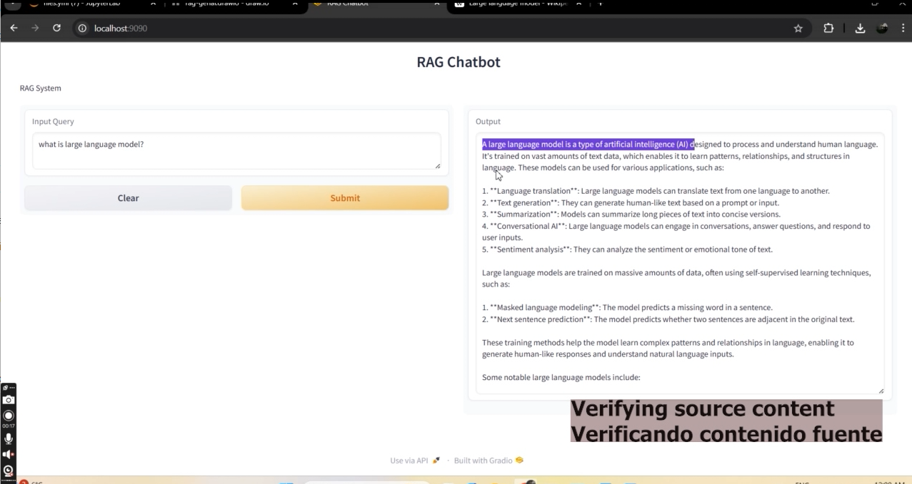
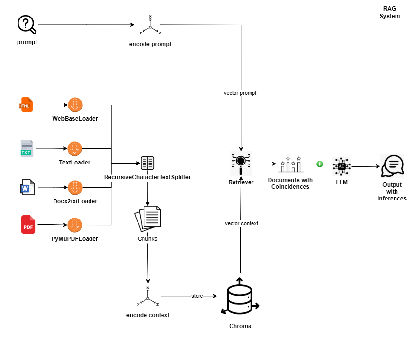

# RAG with LangChain, Hugging Face, and Ollama

This project demonstrates a simple implementation of **Retrieval-Augmented Generation (RAG)** using **LangChain**, with support for models from **Hugging Face** and **Ollama**.


Previous output was tested with content of [Wikipedia](https://en.wikipedia.org/wiki/Large_language_model)

RAG combines information retrieval with a language model to provide answers grounded in external knowledge — perfect for answering questions based on custom PDFs, documents, or datasets.

## Tech Stack

- **LangChain**: Framework to chain LLMs with tools like vector stores and document loaders.
- **ChromaDB**: Lightweight, in-memory vector database for storing document embeddings.
- **Transformers**: Hugging Face library for embeddings and language models.
- **Ollama**: Run LLMs locally (e.g., LLaMA, Mistral) for private, offline inference.
- **Gradio**: Interface for interacting with your RAG system.
- **JupyterLab**: For prototyping and experimentation.
## Components
- **Data loaders**: TextLoader, PyPDFLoader, PyMuPDFLoader, UnstructuredMarkdownLoader, JSONLoader, CSVLoader, UnstructuredCSVLoader, WebBaseLoader, Docx2txtLoader, UnstructuredFileLoader.
- **Test Splitters**: CharacterTextSplitter, RecursiveCharacterTextSplitter, Language, RecursiveCharacterTextSplitter, MarkdownHeaderTextSplitter, HTMLHeaderTextSplitter, HTMLSectionSplitter.
- **Retrievers**: Simple similarity search (vdb.as_retriever()), MMR Retrieval (vdb.as_retriever(search_type="mmr")), Similarity score threshold retrieval (vdb.as_retriever(search_type="similarity_score_threshold", search_kwargs={"score_threshold": 0.4})), MultiQueryRetriever, SelfQueryRetriever, ParentDocumentRetriever.
- **Vector Store**: Chroma, FAISS
- **Chains**: RetrievalQA
## Features

- Load and split documents (PDF, text).
- Embed and store chunks in a vector store (ChromaDB).
- Retrieve relevant chunks based on user queries.
- Generate answers using local (Ollama) or cloud (Hugging Face) LLMs.
- Interactive UI with Gradio.


## Ollama
Install [Ollama](https://ollama.com) (if not already installed) for testing:


Pull a model to use with Ollama (e.g., Mistral):
```bash
ollama run llama3.2:3b
```


## Setup

Create the environment with all requirements:

```bash
conda env create -f rag.yml
conda activate rag
```

## Folder Structure
```
rag-project/
│
├── docs/               # Source documents (PDFs, TXT, etc.)
├── app.py              # Main Gradio app
├── src/                # Images
├── utils/              # Document loaders, embedding helpers
├── rag.yml             # Conda environment file
└── README.md
```
## Example Usage

```bash
python app.py
```

## Additional Notes
**This project uses LLaMA 3.2 for educational purposes. It is not affiliated with Meta.**

**This project uses the 'paraphrase-multilingual-MiniLM-L12-v2' model under the Apache 2.0 license. All original copyright and license notices are retained.**
